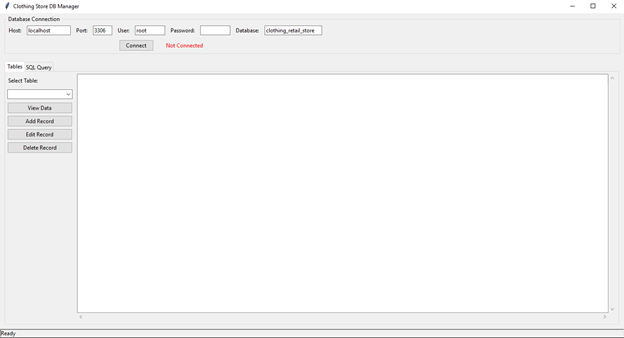
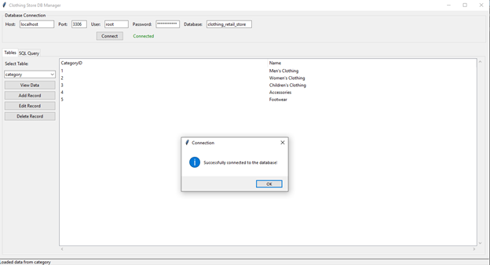
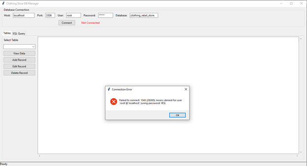
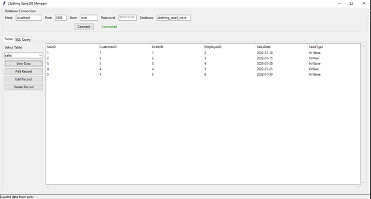
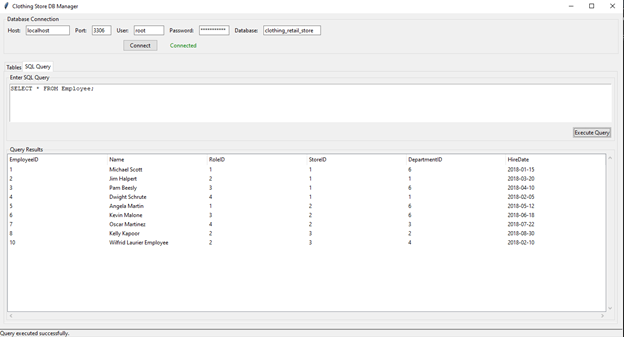
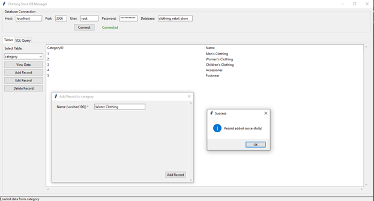
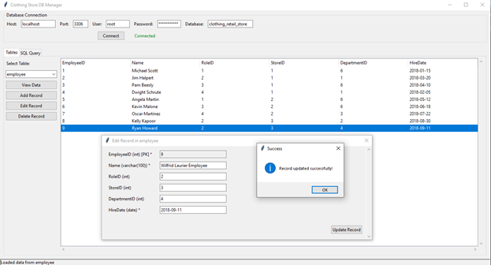
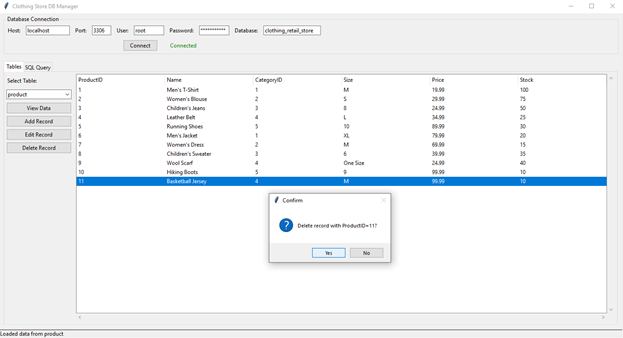

# DBMS Python GUI Interface

## Description

This project is a DBMS interface built using Python for my CP363, Database I class.

## Installation

To run this project locally, you need to install the required dependencies and set up the environment.

### Prerequisites
- `Python 3.x`
- `mysql-connector`
- `tkinter`

### Steps to Install

1. **Clone the Repository:**
   ```bash
   git clone https://github.com/emaa0q/DBMSInterface.git
   ```

2. **Setup a Virtual environment:**
   ```bash
   python -m venv .venv
   ```

3. **Activate the virtual environment:**
   
   On Windows
   ```bash
   .venv\Scripts\activate
   ```
   
   On MacOS
   ```bash
   source .venv/bin/activate
   ```

4. **Install dependencies (We used mysql-connector and tkinter)**
   ```bash
   pip install mysql-connector tkinter
   ```

5. **Finally, run the application**
   ```bash
   python main.py
   ```

## Notes
- You need a functioning MySQL Database in MySQL Workbench that the program will connect to as it is hosted on your own server

## Screenshots

### Program Startup


### Successfully Connected


### Wrong Password Screen


### GUI Reading Function


### SQL Query Execution


### Add Function


### Update Record Function


### Delete Function

